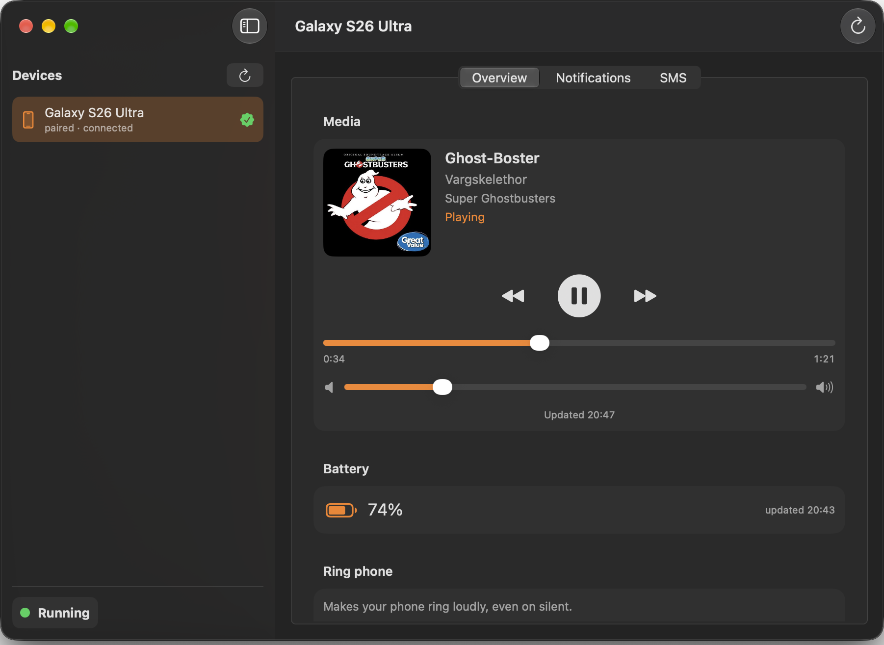
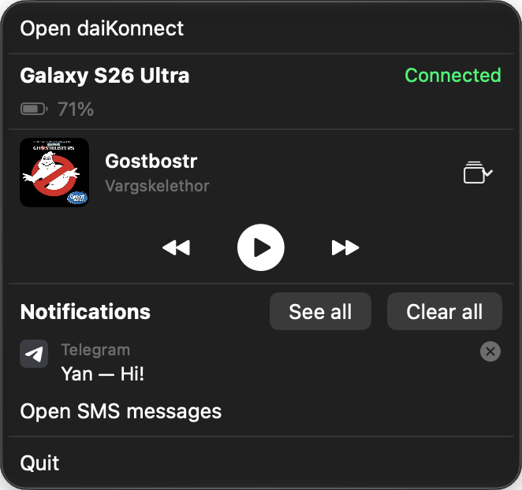
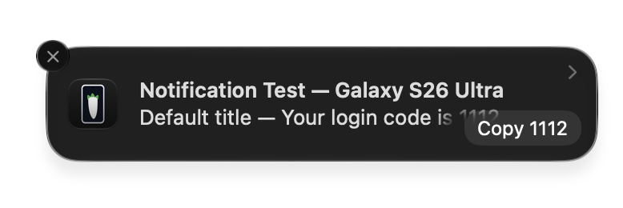
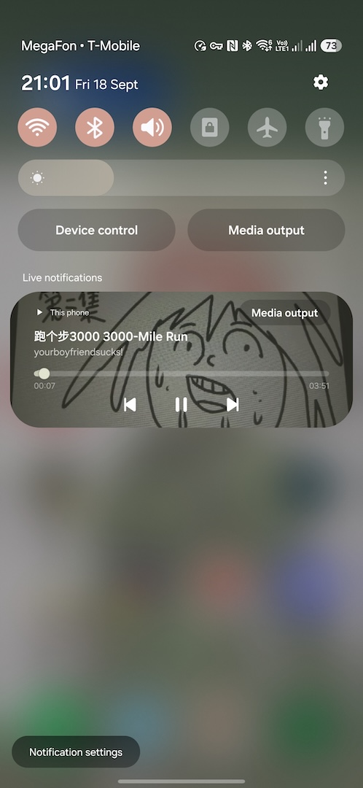

# daiKonnect

## KDE connect client for macOS

## Install

Download latest dmg from releases, do the usual drag and drop, and open it. If you get the "can't verify app" error, go to privacy and security, and whitelist daiKonnect at bottom.

## Screenshots & features

**Tray icon menu!**

**OTP Notification with copy code button!**

**Control music on your Mac from your phone!**

